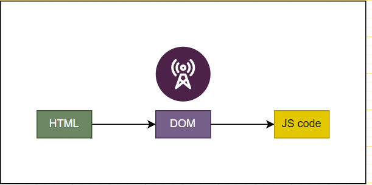
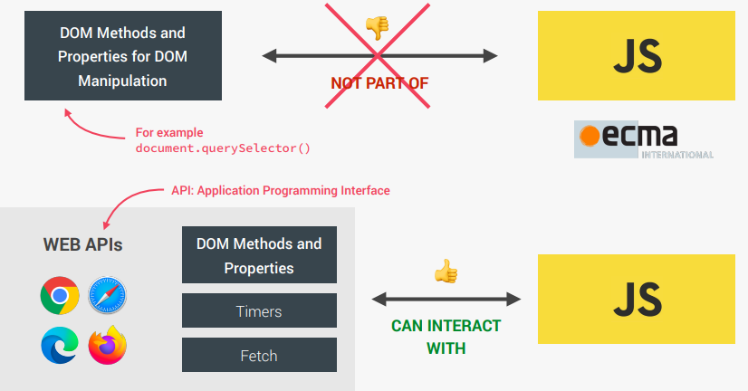

# Document Object Model (DOM)

When we need to make JavaScript interact with the webpage, we use the DOM (Document Object Model).

## Key Points

### Structure Representation:

- The DOM is a structured representation of the HTML elements.
- It allows JavaScript to access and manipulate HTML elements and styles.
- It serves as a connection point between the HTML and JavaScript code.

    

### Creation:

- The DOM is created by the browser when the HTML is loaded.
- For each element in the HTML, there is a corresponding node in the DOM tree.
- We can interact with and access each node using JavaScript.
- The `document` object is the entry point to the DOM.
- The root element in the DOM tree is always the HTML element.

> Everything in the HTML has a representation in the DOM!

## DOM and JavaScript

- The **DOM Methods** and **Properties** for DOM Manipulation are not part of JavaScript itself. Instead, they are part of the **Web APIs**.
- Web APIs are libraries implemented by browsers that we can access from our JavaScript code without needing to import anything explicitly.
- These Web APIs work behind the scenes to provide functionalities like DOM manipulation, timers, fetch APIs, and more.
- There are official DOM specifications to ensure that DOM methods and properties work consistently across all browsers.

    

